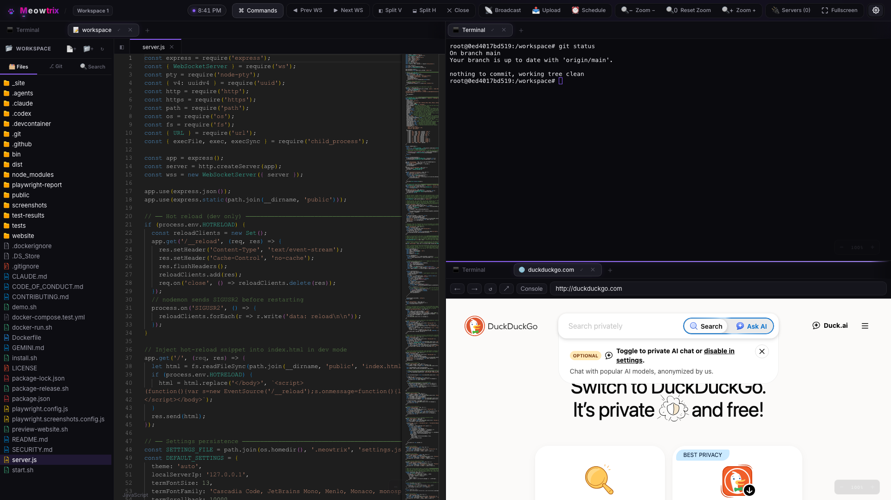
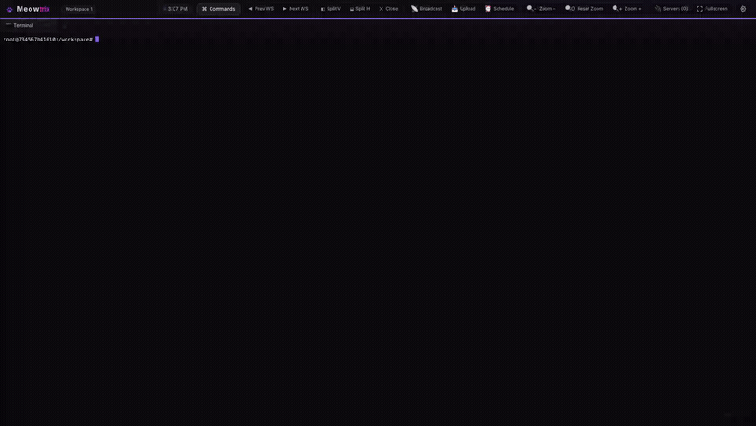
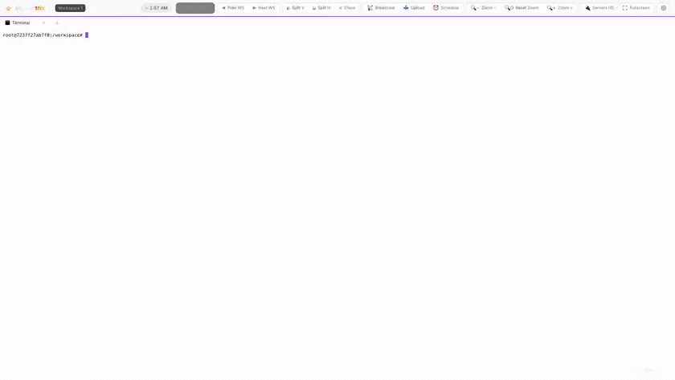
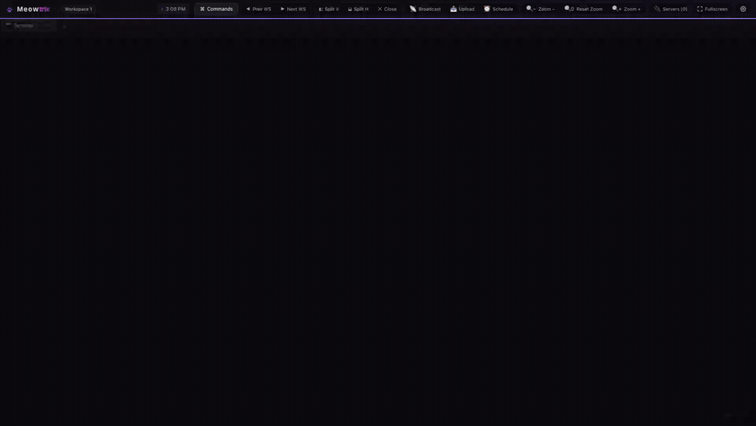
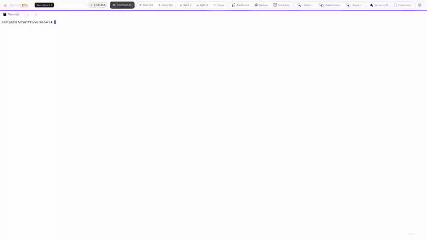
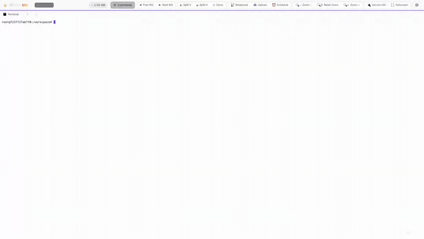
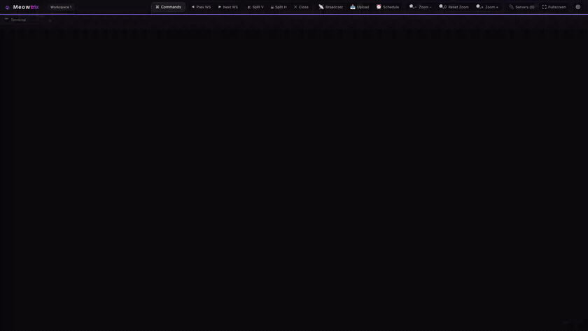

# 🐾 Meowtrix

[](https://github.com/tianhaoz95/meowtrix/actions/workflows/deploy-pages.yml)
[](https://github.com/tianhaoz95/meowtrix/actions/workflows/release.yml)
[](https://github.com/tianhaoz95/meowtrix/actions/workflows/e2e.yml)

Remote vibe engineering tool — a browser-based workspace with tiling split panes, each pane holding tabs that are either a PTY-backed terminal or an embedded browser. Run it on a host machine and reach it from any browser on your network (or anywhere via a tunnel); shells live on the server, so refreshes, device switches, and network blips don't kill your work.

**[Website & docs](https://tianhaoz95.github.io/meowtrix/)** · **[Live demo](https://tianhaoz95.github.io/meowtrix/demo/?demo)** · **[User guide](https://tianhaoz95.github.io/meowtrix/docs/)** · **[Developer docs](https://tianhaoz95.github.io/meowtrix/dev/)**



## Features

- **Tiling panes & tabs** — split vertically or horizontally, drag dividers to resize; each pane holds multiple tabs
  
  

- **Persistent terminals** — full PTY-backed shells via xterm.js that outlive the connection; refresh or reconnect and they reattach with replayed scrollback
  
  

- **Embedded browser panes** — built-in browser with a server-side proxy that strips frame-blocking headers so otherwise un-embeddable pages render in a pane
  
  

- **Code editor tabs** — Monaco (VS Code) editor with file tree sidebar; features side-by-side live **Markdown Preview** (with toggle & quick copy for code blocks) and live **HTML Preview** in browser tabs. Git repos gain a **Source Control** panel (stage/unstage, side-by-side diffs, commit, push/pull) with **AI-powered commit message generation**.
  
  

- **Scheduled Enter presses (⏰)** — queue an `Enter` key press for later (delay or clock time) to run commands automatically, e.g. when an agent usage quota resets. Timers live server-side next to the PTY to survive page reloads and disconnects.
  
  

- **On-device AI Chat Pet (🐾)** — chat with Mochi, a customizable wandering desktop companion (choose from 12 animal faces) powered locally via Chrome's on-device LLM (Gemini Nano via Prompt API).
- **Keystroke Combo FX** — level up your typing with streak rewards: particle bursts, screen shake, edge glow, and heat-tinted combo readouts.
- **Self-updates** — background git check notifies you of updates via an in-app banner; trigger a pull and clean server restart directly from the UI.
- **`mtx` host helper** — `mtx download <file>` pushes a host file to your browser as a download; `mtx code <dir>` opens that directory in a code-editor tab
- **Cross-device sessions** — server-coordinated single active session; move the whole workspace between browsers and devices and your layout follows
- **Command palette** — `⌘K` (or `Ctrl/⌘+Shift+P`) fuzzy launcher for every action: split, new tab, switch tabs/panes, broadcast, themes, settings, schedules, self-update
  
  

- **Localhost-first** — the manual launcher binds to `127.0.0.1` by default so it's not exposed to your network; opt into LAN/remote access explicitly (a `--service` install binds `0.0.0.0`) — see [Network access](#network-access--security)
- **Broadcast input** — mirror keystrokes to every visible terminal at once (like tmux `synchronize-panes`)
- **Mobile-ready** — on-screen key bar with sticky Ctrl/Alt/Cmd modifiers and double-tap autocomplete
- **10 themes** — Midnight, Daylight, Ocean, Matrix, Ember, Sakura, Bubblegum, Catppuccin, Cappuccino, Synthwave; terminals are themed to match
  
  

- **No build step** — plain ES scripts served directly; settings & layout persist to `~/.meowtrix/`


## Prerequisites

Meowtrix runs on the **host machine** (macOS or Linux) — you only need a browser on the devices you connect from. 

Depending on your preferred installation method, the prerequisites differ:

- **Zero-Dependency Install (Recommended):**
  - No dependencies required. The installer automatically downloads the pre-packaged Node.js runtime and compiled native modules for your platform.
- **Source-Based Install:**
  - **Node.js 18+** and **npm** — runs the server
  - **git** — clones the repository
  - **A C/C++ build toolchain** — to compile `node-pty` natively:
    - **macOS:** Xcode Command Line Tools (`xcode-select --install`)
    - **Linux:** `build-essential` (or `gcc`/`make`) and `python3`

> The `--service` auto-start mode is supported on macOS (launchd) and Linux (systemd) only. Windows is not supported by the installer.

## Install

### 1. Zero-Dependency Binary Install (Recommended)

Run the installer:
```bash
curl -fsSL https://raw.githubusercontent.com/tianhaoz95/meowtrix/main/install.sh | bash
```
*Note: If `git` or `node` are not detected on your system, the installer will automatically fall back to downloading a precompiled release. You can force this zero-dependency binary install by passing the `--binary` flag:*
```bash
curl -fsSL https://raw.githubusercontent.com/tianhaoz95/meowtrix/main/install.sh | bash -s -- --binary
```

### 2. Source-Based Install

If you prefer to compile from source and have Node.js, git, and a C/C++ toolchain installed:
```bash
# Clone the repository manually
git clone https://github.com/tianhaoz95/meowtrix.git ~/.meowtrix/app
cd ~/.meowtrix/app

# Run the installer from source
./install.sh
```

---

Then run:

```bash
meowtrix
```

And open `http://localhost:9123` in your browser.

### Running with Docker (Isolated Testing)

For testing Meowtrix without affecting a running production instance or to run in an isolated environment, you can run it inside a Docker container on a random, untaken host port:

```bash
./docker-run.sh
```

Or via npm:

```bash
npm run docker
```

This will automatically:
1. Locate a random untaken port on your host.
2. Build the Docker container image.
3. Start the container in interactive mode.
4. Mount the current directory to `/workspace` inside the container as the terminal's workspace.
5. Create an isolated Docker volume (`meowtrix-dev-settings`) to persist settings/session layout without modifying your host's production `~/.meowtrix/` config.
6. Automatically open the browser to the new testing instance.

You can also pass a custom workspace path to mount:
```bash
./docker-run.sh /path/to/another/folder
```

### Install as a service (auto-start on login)

```bash
curl -fsSL https://raw.githubusercontent.com/tianhaoz95/meowtrix/main/install.sh | bash -s -- --service
```

Uses **launchd** on macOS and **systemd** on Linux. Meowtrix will start automatically on login and restart if it crashes.

> ⚠️ Unlike the manual launcher (localhost-only), a `--service` install binds to **`0.0.0.0` (all interfaces)** by default — the assumption being that an auto-starting service is meant to be reached from other devices. Since there's no built-in auth, only do this on a network you trust, or front it with your own auth/firewall. To keep a service install localhost-only, edit the unit's `HOST` env var to `127.0.0.1` (in `~/Library/LaunchAgents/com.meowtrix.plist` or `~/.config/systemd/user/meowtrix.service`) and reload it.

#### Stopping & starting the service

Once installed with `--service`, control it with the native service manager. Stopping the service kills all in-memory PTYs (running shells).

**macOS (launchd):**

```bash
launchctl unload ~/Library/LaunchAgents/com.meowtrix.plist   # stop (and disable auto-start)
launchctl load   ~/Library/LaunchAgents/com.meowtrix.plist   # start (and re-enable auto-start)
```

To check status: `launchctl list | grep com.meowtrix`. Logs: `~/.meowtrix/meowtrix.log`.

**Linux (systemd):**

```bash
systemctl --user stop    meowtrix   # stop
systemctl --user start   meowtrix   # start
systemctl --user restart meowtrix   # restart
systemctl --user status  meowtrix   # check status
```

To stop it from auto-starting on login: `systemctl --user disable meowtrix` (and `enable` to turn it back on). Logs: `journalctl --user -u meowtrix -f`.

### Update

Re-run the installer — it pulls the latest into `~/.meowtrix/app`:

```bash
curl -fsSL https://raw.githubusercontent.com/tianhaoz95/meowtrix/main/install.sh | bash
```

### Uninstall

To fully uninstall Meowtrix, stop the service (if running), remove the service configuration, and delete the installation files.

**macOS:**

```bash
# Stop and remove the launchd service
launchctl unload ~/Library/LaunchAgents/com.meowtrix.plist 2>/dev/null || true
rm -f ~/Library/LaunchAgents/com.meowtrix.plist

# Remove the launcher and configuration folder
rm -f ~/.local/bin/meowtrix
rm -rf ~/.meowtrix
```

**Linux:**

```bash
# Stop and disable the systemd service
systemctl --user stop meowtrix 2>/dev/null || true
systemctl --user disable meowtrix 2>/dev/null || true
rm -f ~/.config/systemd/user/meowtrix.service
systemctl --user daemon-reload

# Remove the launcher and configuration folder
rm -f ~/.local/bin/meowtrix
rm -rf ~/.meowtrix
```

## Quick start (from source)

```bash
npm install      # node-pty compiles natively
npm start        # serves on PORT (default 9123)
```

Then open `http://localhost:9123` in your browser.

## Network access & security

Meowtrix hands whoever can reach it a **real shell on the host**, so by default it binds to **`127.0.0.1` (localhost only)** — reachable from the host itself but invisible to the rest of the network. (Exception: a `--service` install binds to `0.0.0.0` by default, since an auto-starting service is typically meant to be reached remotely — see [Install as a service](#install-as-a-service-auto-start-on-login).) There are two safe ways to use it remotely:

**1. SSH tunnel (recommended).** Leave the default localhost binding and forward the port over SSH from your client machine:

```bash
ssh -L 9123:localhost:9123 <user>@<host>
# then open http://localhost:9123 in your local browser
```

This keeps Meowtrix off the network entirely — only your authenticated SSH session can reach it. Tunnels like `ngrok http 9123` also work with the default binding, since they connect to localhost on the host.

**2. Bind to the network.** To reach Meowtrix directly from other devices on a **trusted** LAN, bind to all interfaces:

```bash
meowtrix --network         # or: meowtrix --host 0.0.0.0
# from source:
HOST=0.0.0.0 npm start
```

Then open `http://<host-ip>:9123` from any device. You can also bind to one specific interface with `--host <addr>` or the `HOST` env var.

> ⚠️ `--network` exposes a shell to anyone who can reach the port — there is no built-in authentication. Only do this on a network you trust, or front it with your own auth/firewall.

### Dev mode (hot reload)

```bash
./start.sh       # nodemon + browser hot-reload
```

### Packaging a Release

To package Meowtrix into a zero-dependency portable archive for the current host OS & architecture:

```bash
./package-release.sh
```

This script automatically downloads a standalone Node.js binary, installs production dependencies, compiles native modules (`node-pty`), and outputs a `.tar.gz` bundle into the `dist/` directory.


### Containerized development (Dev Container)

A [Dev Container](https://containers.dev) config lives in `.devcontainer/`. Open the repo in VS Code (or GitHub Codespaces) and "Reopen in Container" — it builds on a Debian-based Node image with the toolchain `node-pty` needs, runs `npm install`, preinstalls both the Claude Code CLI (`claude`) and Antigravity CLI (`agy`) into `~/.local/bin` (and adds it to the `PATH`), configures aliases (`ccyolo` for `claude --dangerously-skip-permissions` and `agyyolo` for `agy --dangerously-skip-permissions` in `~/.bashrc`), and forwards port `9123`. Then run `npm start` (or `./start.sh`) inside the container.

## Try the demo (no install)

Meowtrix can run entirely in the browser with no server — terminals become an in-browser JavaScript REPL, and layout/settings persist to `localStorage`.

- **Online:** [tianhaoz95.github.io/meowtrix/demo/?demo](https://tianhaoz95.github.io/meowtrix/demo/?demo)
- **Locally:** `./demo.sh` (serves the static demo and opens it)

In demo mode the browser pane loads URLs directly (no proxy), so only sites that allow embedding will appear.

## Keyboard shortcuts

Use `⌘` on macOS or `Ctrl` elsewhere.

| Shortcut | Action |
|---|---|
| `⌘K` / `Ctrl+Shift+P` | Open the command palette |
| `⌘\` | Split vertical |
| `⌘-` | Split horizontal |
| `⌘T` | New tab |
| `⌘W` | Close tab |
| `⌘B` / `Ctrl+Shift+B` | Toggle broadcast input |

The **command palette** (`⌘K`, or `Ctrl/⌘+Shift+P`) is a fuzzy launcher for every action — splitting, new terminal/browser tabs, switching tabs and panes, broadcast input, theme switching, and settings. Type to filter, arrow keys to move, `Enter` to run.

Double-click (or double-tap) inside a terminal to send `Tab` for autocomplete.

## Settings

Settings are saved to `~/.meowtrix/settings.json` on the host machine; the workspace layout is saved to `~/.meowtrix/session.json`.

| Setting | Default |
|---|---|
| Theme | Midnight (dark) |
| Terminal font size | 13 |
| Terminal font | Cascadia Code |
| Scrollback | 10,000 lines |
| Shell | `$SHELL` (falls back to `/bin/bash`) |
| Browser homepage | blank (shows a start page) |

## How it works

A single `server.js` hosts the static frontend, the settings/session REST API, and a WebSocket that multiplexes PTY sessions; PTYs are kept in memory and outlive WebSocket connections so reconnects are non-destructive. The frontend is plain global-scope ES scripts under `public/` (no bundler). See the [developer docs](https://tianhaoz95.github.io/meowtrix/dev/) and `CLAUDE.md` for the full architecture.
